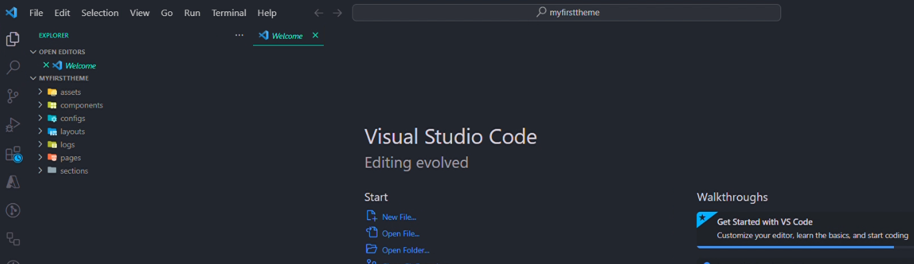

The default directory structure for taojaa themes is as follows:

- [assets](#assets)
- [components](#components)
- [config](#config)
- [layout](#layout)
- [pages](#pages) 
- [sections](#sections)

```
├── assets
├── components
├── configs
├── layout
├── logs
├── pages 
└── sections

```

on vs code



# assets

```
├── assets
│   ├── css
│   │      ├──  ****   
│   │      ├──  ****              
│   ├── dist
│   │      ├── ****     
│   │      ├── ****               
│   ├── js             
│   │   ├── *****      
│   │   ├── *****       
│   └── vendor          
│       ├── *****       
│       ├── *****       
│       └── *****       
│   
```


## components
This folder contains components that can be reused or updated in our code, enabling developers to efficiently manage and update specific sections of a page on the Taojaa store. By utilizing these components, developers can ensure consistent design and functionality across different pages and easily make updates when necessary.

## config
This folder contains a `config.json` file that allows developers to apply UI configurations through a root object containing various user interface components. Within this JSON file, lines 3-16, 18-22, and 24-29 include the `newsletter_popup`, `footer`, and `background_color` components. These components can be modified through the properties specified in their respective `value` fields.
```javascript title="settings.json" {3-16,18-22,24-29} showLineNumbers
{
    "preset": {
        "newsletter_popup": {
            "image": {
                "type": "image",
                "value": "https://res.cloudinary.com/daisikwbm/image/upload/v1717351113/pexels-tubarones-2764975_d7bn3w.jpg"
            },
            "title": {
                "type": "text",
                "value": "Subscribe to newsletter"
            },
            "description": {
                "type": "text",
                "value": "get 15% off"
            } 
        },

        "footer": {
            "text_color": {
                "type": "color",
                "value": ""
            },

            "background_color": {
                "type": "color",
                "value": ""
            }
        }
    }
}

```
Here is a breakdown of the components and their editable properties:

- Newsletter Popup (Lines 3-16):

  - Image:
    - Type: Defines the type of the image element (e.g., "image").
    - Value: URL of the image to be displayed.

  - Title:
    - Type: Defines the type of the title element (e.g., "text").
    - Value: Text content for the title (e.g., "Subscribe to newsletter").

  - Description:
    - Type: Defines the type of the description element (e.g., "text").
    - Value: Text content for the description (e.g., "get 15% off").

- Footer (Lines 18-22):
   - Text Color:
       - Type: Defines the type of the text color element (e.g., "color").
       - Value: Specifies the color value for the text.

   - Background Color:
      - Type: Defines the type of the background color element (e.g., "color").
      - Value: Specifies the color value for the background.


By modifying the values of these properties, developers can customize the appearance and behavior of the UI components to suit their specific requirements. all the configurations would be available for the vendor on the theme editor 


## layout
 This section is dedicated to creating store layouts. The asset URL, provided by Taojaa, is injected into this file and points to the asset folder. You can create as many layouts as needed in the layout folder.


## Pages
This folder contains a list of reusable components that can be updated within our code. The purpose of these components is to allow developers to update specific sections of their store pages dynamically when certain actions are performed. The JSON files in the pages directory are used to configure the vendor store pages by utilizing the layout and section definitions.

The pages directory contains all JSON files associated with the vendor's store pages. When creating a new page JSON file, the provided JSON object will be used to render the components on the page.


```javascript title="pages.json" {2-6} showLineNumbers
{
    "layout": "",

    "sections": {},

    "order": []
}

```


```javascript title="pages.json example" {3-4,7-43,46-49} showLineNumbers
{
  
    "layout": "main",

    
    
    
    "sections": {
        "contact-header": {
            "type": "contact-header",
            "settings": {
                "background": {
                    "type": "image",
                    "default": ""
                },
                "heading": {
                    "type": "text",
                    "default": "store.name"
                },
                "subheading": {
                    "type": "text",
                    "default": "Contact Us"
                }
            }
        },
        "contact-details": {
            "type": "contact-details",
            "settings": {
                "heading": {
                    "type": "text",
                    "default": "BEST OFFER"
                },
                "sub_heading": {
                    "type": "text",
                    "default": "Contact information"
                },
                "description": {
                    "type": "textarea",
                    "default": "Lorem ipsum dolor sit amet, consectetur adipiscing elit. Mauris eget efficitur quam. Cras pharetra eros mi."
                }
            }
        }
    },


    "order": [
        "contact-header",
        "contact-details"
    ]
}
```
The JSON files within the pages folder contain three key-value pairs: layout, section, and order. These pairs are crucial for defining the structure and behavior of each page. Below is a detailed explanation of each key-value pair:

Key-Value Pairs
   1. Layout

      Description: The layout key specifies which layout from the layout folder should be applied to the page. This allows for consistent styling and structure across different pages by reusing predefined layouts.

    
   2. Section

      Description: The section key is used to define various sections that the page will contain. Each section represents a distinct part of the page, such as the header, footer, or content areas.

      
   3. Order

      Description: The order key dictates the sequence in which the sections should be rendered on the page. Sections not listed in the order array will not be displayed, as demonstrated in the provided code block.

   4. Data Section
     The JSON files also support a data section, which enables developers to configure the type of data and its rendering. This section is essential for dynamic content management and can be customized to fit various data sources and display requirements.

      
  


## sections

The ssctions folder contains all our partial html 


